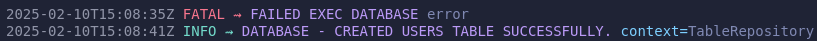
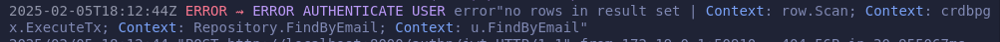

<div align="center">

# Logella

A simple loggers and errors library.

</div>


<div align="left">

### Packages:

- <a href="#logger-package">
   Logger
  </a> 

- <a href="#errs-package">
   Errs
  </a> 
  
- <a href="#router-package">
    Router
</a>    

- <a href="#response-package">
    Response
</a>  

</div>

<br><br>

## Logger Package

This package defines the log settings (zerolog). Allows you to use default or customized colors configuration.

### Import
```go
import "github.com/Lucasvmarangoni/logella/config/log"
```

**ConfigDefault**: It has pre-defined log color settings, meaning there is no need to specify a any parameter.

```go
logger.ConfigDefault(out io.Writer)
```
Example: 
```go
logger.ConfigDefault(os.Stdout)
```

**ConfigCustom**: Allows you to customize log level, message, and operation colors.

```go
ConfigCustom(info, err, warn, debug, fatal, message, trace colors, , out io.Writer)
```

The parameters must be passed using the variables already defined by the package with the name of the colors.

<u>Colors</u>: Black, Red, Green, Yellow, Blue, Magenta, Cyan or White.

Example:


```go
logger.ConfigCustom(logger.Green, logger.Red, logger.Yellow, logger.Cyan, logger.Red, logger.Magenta, logger.Blue, os.Stdout)
```

**Use Case**
```go
log.Info().Str("context", "TableRepository").Msg("Database - Created users table successfully.")
```

Output:



<br>

## Errs Package

The `Errs` package is a custom error handling library. Its primary feature is to attach Traceual information to errors, allowing them to be propagated up the call stack. 

It also provides standardized error types, such as `invalid` and `required`.

Output Example:
```go
log.Error().Err(errs.Trace(err).Stack()).Msg("example error")
log.Error().Err(errs.Unwrap(err).Stack()).Msg("example error")
log.Error().Err(errs.Unwrap(err).Stack()).Msg("example error")
```



➤ It is possible click on the path value (<u>test/test.go:15</u>) to go directly to file and line.

### Import
```go
import "github.com/Lucasvmarangoni/logella/err"
```

### Use

```go
func main() {
	_, err := handler()
	log.Error().Err(errs.Unwrap(err).Stack()).Msg(fmt.Sprint(errs.Unwrap(err).Code)) 
	log.Error().Err(errs.Trace(err).ToClient()).Msg(fmt.Sprint(errs.Unwrap(err).Code))
}

func handler() (string, error) {
	_, err := service()
	return "", errs.Trace(err)
}

func service() (string, error) {
	err := repository()
	if err != nil {
		return "", errs.Trace(err)
	}
	return "", nil
}

func repository() error {
	return errs.Wrap(errors.New("test error"), 500)
}
```

<a href="#error">**Error**</a>: the Error Struct.

<a href="#wrap">**Wrap**</a>: Used to add the new error and the trace that throw the exception. 

<a href="#trace">**Trace**</a>: Used to add the trace to stack.

<a href="#trace-method">**Trace (method)**</a>: Used to add the trace manuelly to stack.

<a href="#stack">**Stack**</a>: Stack returns the error along with the operations stack. Used in internals Logs.

<a href="#toclient">**ToClient**</a>: Used to send error message to client.

<a href="#msg">**Msg**</a>: Used to add a message to error.

<a href="#unwrap">**Unwrap**</a>: It makes the type assertion and is used to access de Error Struct whitout performing other functionality.

<a href="#gethttpstatusfrompgerror">**GetHTTPStatusFromPgError**</a>: Used to determine HTTP status automatically based on database error message.

<a href="#new">**New**</a>: Used to add the trace to stack without http status code. Recommended for incializations exceptions.

<a href="#unwrap">**FailOnErrLog**</a>: Used to throw a fatal log in a simple way and with trace stack.

<a href="#panicerr">**PanicErr**</a>: Used to throw a panic based on a error value, whitout the needs to manualy use an if conditional.

<a href="#panicbool">**PanicBool**</a>: Used to throw a panic based on a boolean value, whitout the needs to manualy use an if conditional.

<a href="#isrequirederror">**IsRequiredError**</a>: Used to simplify create a "is requered" error with fmt.Errorf.

<a href="#isinvaliderror">**IsInvalidError**</a>: Used to simplify create a "is invalid" error with fmt.Errorf.


#### Error
```go
type Error struct {
	Cause   error   // The actual error thrown
	Code    int     // HTTP Status Code
	Message string  // Custom message
	trace error
}
```

#### Wrap
```go
func Wrap(cause error, code int) error
```

Example:
```go
errs.Wrap(err, http.StatusInternalServerError)
```

Use case:
```go
cfg.Db, err = pgx.ParseConfig(url)
if err != nil {
    return nil, errs.Wrap(err, http.StatusInternalServerError)
}
```

#### Trace

```go
func Trace(err error) *Error
```

Example:
```go
errs.Trace(err)
```

Use Case:
```go
func service() (string, error) {
	err := repository()
	if err != nil {
		return "", errs.Trace(err)
	}
	return "", nil
}

func repository() error {
	return errs.Wrap(errors.New("test error"), 500)
}
```

**Recommendation**: When an error is issued in a situation that does not involve a call, such as in a conditional comparison, it is recommended that you encapsulate this inside a function, as follows:

```go
func checkStatusCode(resp *http.Response) error {
	if resp.StatusCode != http.StatusOK {
		return fmt.Errorf("status code is not OK. got %d (%s), want %d (%s)",
			resp.StatusCode, http.StatusText(resp.StatusCode),
			http.StatusOK, http.StatusText(http.StatusOK))
	}
	return nil
}

if err := checkStatusCode(resp); err != nil {
		return errs.Trace(err)
	}
```

Or use Trace Method, like above:


#### Trace-method
This method can be used in different situations when you needed to inject your especific trace manually.

- When an error is throw inside an anonymous function;
- When an error is throw from an external library method; 
- Whem an error is issued in a situation that does not involve a call, such as in a conditional comparison.

```go
(e *Error) Trace(trace string) *Error
```
Example:
```go
errs.Wrap(err, http.StatusBadRequest).Trace("AnonymousFunction")
```

Use Case:
```go
func ExternalMethod() error {
	return errors.New("test error")
}

func Repository() error {
err := ExternalMethod()
	if err != nil {
		return errs.Wrap(err, http.StatusBadRequest).Trace("ExternalMethod")
	}
	return nil
}
// path main.go:105 trace ExternalMethod:repository ➤ service ➤ handler ➤ main"
```

#### Stack

```go
func (e *Error) Stack() error 
```

Example:
```go
log.Error().Err(errs.Trace(err).Stack())
```

Use Case:
```go
authdata, err := u.userService.VerifyTOTP(id, totpToken.Token)
	if err != nil {
		w.Header().Set("Content-Type", "application/json")
		w.WriteHeader(errs.Unwrap(err).Code)
		json.NewEncoder(w).Encode(map[string]string{
			"status":     http.StatusText(errs.Unwrap(err).Code),
			"message":    fmt.Sprintf("%v", errs.Unwrap(err).ToClient()),
			"request_id": requestID,
		})
		log.Error().Err(errs.Trace(err).Stack()).Msgf("error validate totp. | (%s)", requestID)
		return
	}
```

#### ToClient
Check the Code of the error to if it is 500 return "Internal Server Error" instead of Cause (actual error)

```go
func (e *Error) ToClient() error  
```

Example:
```go
errs.Unwrap(err).ToClient()
```

```go
	log.Error().Err(errs.Unwrap(err).ToClient()).Msg(fmt.Sprint(errs.Unwrap(err).Code)) 
	// OUTPUT: 2025-02-20T18:29:26-03:00 ERROR ⇝ 500 error"Internal Server Error"
```

Use Case:
```go
authdata, err := u.userService.VerifyTOTP(id, totpToken.Token)
	if err != nil {
		w.Header().Set("Content-Type", "application/json")
		w.WriteHeader(errs.Unwrap(err).Code)
		json.NewEncoder(w).Encode(map[string]string{
			"status":     http.StatusText(errs.Unwrap(err).Code),
			"message":    fmt.Sprintf("%v", errs.Unwrap(err).ToClient()),
			"request_id": requestID,
		})
		log.Error().Err(errs.Trace(err).Stack()).Msgf("error validate totp. | (%s)", requestID)
		return
	}
```

#### Msg

```go
func (e *Error) Msg(message string) 
```

Example:
```go
errs.Trace(err).Msg("Message")
message := errs.Trace(err).Message
```


#### Unwrap
Used when you should not add a trace to the error. Otherwise a duplicate trace will be added.

```go
func Unwrap(err error) *Error 
```

Example:
```go
errs.Unwrap(err).Msg("Message")
message := errs.Unwrap(err).Message
code := errs.Unwrap(err).Code
cause := errs.Unwrap(err).Cause
```

Use Case
```go
log.Error().Err(errs.Trace(err).Stack()).Msg(fmt.Sprint(errs.Unwrap(err).Code))
```

```go
authdata, err := u.userService.VerifyTOTP(id, totpToken.Token)
	if err != nil {
		w.Header().Set("Content-Type", "application/json")
		w.WriteHeader(errs.Unwrap(err).Code)
		json.NewEncoder(w).Encode(map[string]string{
			"status":     http.StatusText(errs.Unwrap(err).Code),
			"message":    fmt.Sprintf("%v", errs.Unwrap(err).ToClient()),
			"request_id": requestID,
		})
		log.Error().Err(errs.Trace(err).Stack()).Msgf("%s. | (%s)", errs.Unwrap(err).Message, requestID)
		return
	}
```

#### GetHTTPStatusFromPgError 
**Compatible with PGX V5 library**

A function to determine HTTP status automatically based on database error message.

```go
func GetHTTPStatusFromPgError(err error) int
```
Example: 
```go
return errs.Wrap(err, "row.Scan", errs.GetHTTPStatusFromPgError(err))
```

Use Case: 
```go
func (r *UserRepositoryDb) UpdateOTP(user *entities.User, ctx Trace.Trace) error {
	sql := `UPDATE users SET otp_auth_url = encrypt($2::BYTES, $4::BYTES, 'aes'), otp_secret = encrypt($3::BYTES, $4::BYTES, 'aes') WHERE id = $1`
	err := crdbpgx.ExecuteTx(ctx, r.conn, pgx.TxOptions{}, func(tx pgx.Tx) error {
		_, err := tx.Exec(ctx, sql,
			user.ID,
			user.OtpAuthUrl,
			user.OtpSecret,
			r.key,
		)
		if err != nil {
			return errs.Wrap(err, errs.GetHTTPStatusFromPgError(err))
		}
		return nil
	})
	if err != nil {
		return errs.Trace(err)
	}
	return nil
}
```


#### New

```go
New(cause error) *Error
```

Example:
```go
err := errs.New(errors.New("error"))
```

Use Case:
```go
func (r *TableRepositoryDb) initUserTable(ctx context.Context) error {
	_, err := r.tx.Exec(ctx, `CREATE TABLE IF NOT EXISTS users (
			id UUID PRIMARY KEY NOT NULL,
			name VARCHAR(15) NOT NULL,
			last_name BYTEA NOT NULL,				
			email BYTEA UNIQUE NOT NULL,				
			password TEXT NOT NULL,		
			created_at TIMESTAMP NOT NULL			
		)`)
	if err != nil {
		return errs.New(err)
	}
	log.Info().Str("context", "TableRepository").Msg("Database - Created users table successfully.")
	return nil
}
```

#### FailOnErrLog


```go
FailOnErrLog(err error, msg string)
```

Example:
```go
errs.FailOnErrLog(err, "database failled")
```

Use Case:
```go
if err = Database(); err != nil {
	errs.FailOnErrLog(err, "database failled")
}
```

#### PanicErr

```go
PanicErr(err error, msg string)
```

#### PanicBool

```go
PanicBool(boolean bool, msg string)
```

#### Standard Errors

The package provides standardized errors, such as `IsInvalidError` and `IsRequiredError`. Here's an example of how to use `IsInvalidError`:

```go
errs.IsInvalidError("Customer", "Must be google uuid")
```

- IsInvalidError(fieldName, msg string) error
- IsRequiredError(fieldName, msg string) error
- FailOnErrLog(err error, msg string)
- PanicErr(err error, ctx string)
- PanicBool(boolean bool, msg string)

<br>


## Router Package

The `Router` is a logging package for initializing routes using go-chi.


### Import

```go
import "github.com/Lucasvmarangoni/logella/router"
```

### Use

```go
router := router.NewRouter()
r := router.Chi
userRouter := routers.NewUsersRouter(userHandler, router)

r.Route("/", func() {
		r.Use(jwtauth.Verifier(tokenAuth))
		r.Use(jwtauth.Authenticator)
		userRouter.UserRoutes(r)	
})
```

```go
router.Route("/authn", func() {
	router.Post("/login", u.userHandler.Authentication)
	router.Group(func(){
		router.Use(httprate.Limit(
			4,
			60*time.Minute,
			httprate.WithKeyFuncs(httprate.KeyByRealIP, httprate.KeyByEndpoint),
			httprate.WithLimitHandler(func(w http.ResponseWriter, r *http.Request) {
				http.Error(w, "Rate limit exceeded", http.StatusTooManyRequests)
			}),
		))	
		router.Post("/login", u.userHandler.Authentication)
	})
})
```

<a href="#router">**Router**</a>: The Router Struct.

<a href="#newrouter">**NewRouter**</a>: To create a new instance of the `Router`, and chi.Router instance (chi.NewRouter()).

<a href="#methods">**Methods**</a>: All http Methods. Used in the same way as in go-chi lib.

<a href="#route">**Route**</a>: Reclaces go-chi's route method.


#### Router

```go
type Router struct {
	Chi    chi.Router
	mux    *chi.Mux
	Prefix string
}
```

#### Instance Creation

```go
func NewRouter() *Router {
	r := &Router{
		Chi: chi.NewRouter(),
	}
	return r
}
```

```go
router := router.NewRouter()
```

#### Methods

```go
(r *Router) Group(fn func()) *Router
(r *Router) Use(ms ...func(http.Handler) http.Handler) *Router
(r *Router) Post(pattern string, handler http.HandlerFunc)
(r *Router) Get(pattern string, handler http.HandlerFunc)
(r *Router) Put(pattern string, handler http.HandlerFunc)
(r *Router) Path(pattern string, handler http.HandlerFunc)
(r *Router) Delete(pattern string, handler http.HandlerFunc)
```

#### Route

```go
(r *Router) Route(pattern string, fn func(sub *Router))
```

## Response Package

<a href="#new">**New**</a>: Creates a new Response instance from an error. Wrap your error with a status code using errs.Wrap.

<a href="#log">**Log**</a>: Sets a log message to be included in the application log. Should come after Req and User, if present.

<a href="#req">**Req**</a>: Adds the request ID to the response.>

<a href="#user">**User**</a>: Adds the user ID to the response.

<a href="#date">**Date**</a>: Sets a fixed timestamp for the response. Useful for tests or consistent logging.

<a href="#doc">**Doc**</a>: Adds a documentation string (e.g., a URL or identifier) to the response.

<a href="#send">**Send**</a>: Finalizes the chain. Writes the JSON response and status code to the http.ResponseWriter.

### Use Case

```go
response.New(errs.Wrap(errors.New("some error"), http.StatusBadRequest)).
		Req("123").
		User("12345").
		Log("LOG MESSAGE").
		Date(&fixed).
		Send(w)
```

### Struct
```go
type Response struct {
	Err           error      `json:"-"`
	Error         string     `json:"error"`
	Message       string     `json:"message"`
	Status        string     `json:"status"`
	RequestID     string     `json:"request_id,omitempty"`
	UserID        string     `json:"user_id,omitempty"`
	Timestamp     *time.Time `json:"timestamp,omitempty"`
	Documentation string     `json:"documentation,omitempty"`
}
```

### Constructor
```go
New(err error) *Response
```
### Parameters Methods

```go
(r *Response) Log(msg string) *Response
(r *Response) Req(requestID string) *Response
(r *Response) User(userID string) *Response
(r *Response) Date(timestamp *time.Time) *Response
(r *Response) Doc(documentation string) *Response
```
- Log should come after Req and User, if present.

### Send
Must be called at the end of the chain.
```go
(r *Response) Send(w http.ResponseWriter)
```