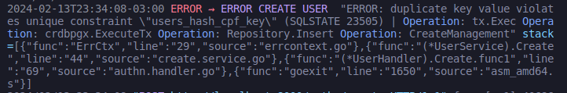

# Outros pacotes serão adicionados em breve

## Errcontext

Uma pacote de erros personalidados. Sua funcionalidade principal é adicionar informação de contexto aos erros, propagando as para cima na cadeia de chamadas. 

Também disponibiliza erros padronizados, como invalid e required.

### ErrCtx(err error, value string)

Criar um erro com contexto.

    cfg.Db, err = pgx.ParseConfig(url)
	if err != nil {
		return nil, errors.ErrCtx(err, "pgx.ParseConfig(url)")
	}

 

    dbConnection, err := db.Connect(ctx)
	if err != nil {
		return nil, errors.ErrCtx(err, "db.Connect")
	}

Saida: 

Observe o campo "Operation", essa é a principal funcionalidade desse pacote.

### Erros padronizados

Exemplo: 
**IsInvalidError(fieldName, msg string)**

    errors.IsInvalidError("Customer", "Must be google uuid")

**Lista de erros disponivel:**

- IsRequiredError
- IsInvalidError