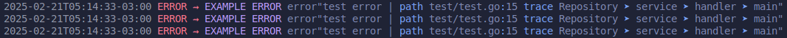

<div align="center">

# Logella

A simple loggers and errors library.

</div>


<div align="left">

### Packages:

- <a href="#logger-package">
   Logger
  </a> 

- <a href="#errors-package">
   Errors
  </a> 

- <a href="#router-package">
    Router
</a>       
</div>

<br><br>

## Logger Package

This package defines the log settings (zerolog). Allows you to use default or customized colors configuration.

### Import
```go
import "github.com/Lucasvmarangoni/logella/config/log"
```

**ConfigDefault**: It has pre-defined log color settings, meaning there is no need to specify a any parameter.

```go
logger.ConfigDefault()
```

**ConfigCustom**: Allows you to customize log level, message, and operation colors.

```go
ConfigCustom(info, err, warn, debug, fatal, message, operation colors)
```

The parameters must be passed using the variables already defined by the package with the name of the colors.

<u>Colors</u>: Black, Red, Green, Yellow, Blue, Magenta, Cyan or White.

Example:


```go
logger.ConfigCustom(Green, Red, Yellow, Cyan, Red, Magenta, Blue)
```

<br><br>


## Errs Package

The `Errs` package is a custom error handling library. Its primary feature is to attach contextual information to errors, allowing them to be propagated up the call stack. 

It also provides standardized error types, such as `invalid` and `required`.


### Import
```go
import "github.com/Lucasvmarangoni/logella/err"
```

**Wrap**: Ctx is used to add the error and the operation that triggered the exception. 
The operations stack is not returned by ErrCtx, but rather persisted. 

**Assertion**: Used to make a type assertion error. 

**Context**: Used to add context do stack.

**GetContext**: GetOperations is used to retrieve only the operations stack.

**Stack**: Stack returns the error along with the operations stack. Used in internals Logs.

**ToClient**: Used to send error message to client.

**Msg**: Used to add a message to error.



### Use
```go
errs.Wrap(err, "repo.InitTables")
errs.Assertion(err)
errs.Context("string")
errs.GetContext()
errs.Stack()
errs.ToClint()
errs.Msg("string")
```

### Error Struct

```go
type Error struct {
	Cause   error   // The actual error thrown
	Code    int     // HTTP Status Code
	Message string  // Custom message
	added   bool
	context error
}
```

### Status

```go
var Status = map[int]string{
	http.StatusBadRequest:          "BadRequest",
	http.StatusUnauthorized:        "Unauthorized",
	http.StatusForbidden:           "Forbidden",
	http.StatusInternalServerError: "InternalServerError",
	http.StatusNotFound:            "NotFound",
}
```

Example:
```go
errs.Status[errs.Assertion(err).Code]
errs.Status[http.StatusBadrequest]
```

Use Case:
```go
authdata, err := u.userService.VerifyTOTP(id, totpToken.Token)
	if err != nil {
		w.Header().Set("Content-Type", "application/json")
		w.WriteHeader(errs.Assertion(err).Code)
		json.NewEncoder(w).Encode(map[string]string{
			"status":     errs.Status[errs.Assertion(err).Code],
			"message":    fmt.Sprintf("%v", errs.Assertion(err).ToClient()),
			"request_id": requestID,
		})
		log.Error().Err(errs.Assertion(err).Stack()).Msgf("error validate totp. | (%s)", requestID)
		return
	}
```

### Wrap
```go
func Wrap(cause error, contextValue string, code int) error
```

Example:
```go
errs.Wrap(err, "pgx.ParseConfig(url)", http.InternalServerError)
```

Use case:
```go
errs.Wrap(err, "pgx.ParseConfig(url)", http.InternalServerError)
cfg.Db, err = pgx.ParseConfig(url)
if err != nil {
    return nil, errs.Wrap(err, "pgx.ParseConfig(url)", http.InternalServerError)
}
```

### Assertion

```go
func Assertion(err error) *Error
```

Example:
```go
errs.Assertion(err)
errs.Assertion(err).Code
errs.Assertion(err).Cause
errs.Assertion(err).Message
```

Use Case:
Example:
```go
Err     := errs.Assertion(err)
code    := errs.Assertion(err).Code
cause   := errs.Assertion(err).Cause
message := errs.Assertion(err).Message
```

### Context

```go
func (e *Error) Context(operationValue string) error 
```

Example:
```go
errs.Assertion(err).Context("context")
```

Use Case:
```go

func service() (string, error) {	
	return "", errs.Wrap(errors.New("test error"), "anything", http.StatusInternalServerError)
}

func textError() (string, error) {
	_, err := service()	
   	errs.Assertion(err).Context("add extra context")
	return "", errs.Assertion(err).Context("retuned context")
}

func main(){
    _, err := textError()
    log.Error().Err(errs.Assertion(err).Stack()).Msg(fmt.Sprint(errs.Assertion(err).Code)) // Log
	log.Error().Err(errs.Assertion(err).ToClient()).Msg(fmt.Sprint(errs.Assertion(err).Code)) // Client
}
// output
// Log: {"level":"error","error":"test error | Context: anything; Context: add extra context; Context: retuned context","time":"2025-02-05T15:53:17-03:00","message":"500"}
// Clint: {"level":"error","error":"Internal Server Error","time":"2025-02-05T15:53:17-03:00","message":"500"}
```

### Stack

```go
func (e *Error) Stack() error 
```

Example:
```go
log.Error().Stack().Err(errs.Assertion(err).Stack()).Msg("Error authenticate user")
```

Use Case:
```go
authdata, err := u.userService.VerifyTOTP(id, totpToken.Token)
	if err != nil {
		w.Header().Set("Content-Type", "application/json")
		w.WriteHeader(errs.Assertion(err).Code)
		json.NewEncoder(w).Encode(map[string]string{
			"status":     errs.Status[errs.Assertion(err).Code],
			"message":    fmt.Sprintf("%v", errs.Assertion(err).ToClient()),
			"request_id": requestID,
		})
		log.Error().Err(errs.Assertion(err).Stack()).Msgf("error validate totp. | (%s)", requestID)
		return
	}
```

### ToClient
Check the Code of the error to if it is 500 return "Internal Server Error" instead of Cause (actual error)

```go
func (e *Error) ToClient() error  
```

Example:
```go
errs.Assertion(err).ToClient()
```

Use Case:
```go
authdata, err := u.userService.VerifyTOTP(id, totpToken.Token)
	if err != nil {
		w.Header().Set("Content-Type", "application/json")
		w.WriteHeader(errs.Assertion(err).Code)
		json.NewEncoder(w).Encode(map[string]string{
			"status":     errs.Status[errs.Assertion(err).Code],
			"message":    fmt.Sprintf("%v", errs.Assertion(err).ToClient()),
			"request_id": requestID,
		})
		log.Error().Err(errs.Assertion(err).Stack()).Msgf("error validate totp. | (%s)", requestID)
		return
	}
```

### Msg

```go
func (e *Error) Msg(message string) 
```

Example:
```go
errs.Assertion(err).Msg("Message")
message := errs.Assertion(err).Message
```

### Standard Errors

The package provides standardized errors, such as `IsInvalidError` and `IsRequiredError`. Here's an example of how to use `IsInvalidError`:

```go
errs.IsInvalidError("Customer", "Must be google uuid")
```

- IsInvalidError(fieldName, msg string) error
- IsRequiredError(fieldName, msg string) error
- FailOnErrLog(err error, msg string)
- PanicErr(err error, ctx string)
- PanicBool(boolean bool, msg string)

<br><br>

### GetHTTPStatusFromPgError 
**Compatible with PGX V5 library**

A function to determine HTTP status automatically based on database error message.

```go
func GetHTTPStatusFromPgError(err error) int
```
Example: 
```go
return errs.Wrap(err, "row.Scan", errs.GetHTTPStatusFromPgError(err))
```

Use Case: 
```go
func (r *UserRepositoryDb) UpdateOTP(user *entities.User, ctx context.Context) error {
	sql := `UPDATE users SET otp_auth_url = encrypt($2::BYTES, $4::BYTES, 'aes'), otp_secret = encrypt($3::BYTES, $4::BYTES, 'aes') WHERE id = $1`
	err := crdbpgx.ExecuteTx(ctx, r.conn, pgx.TxOptions{}, func(tx pgx.Tx) error {
		_, err := tx.Exec(ctx, sql,
			user.ID,
			user.OtpAuthUrl,
			user.OtpSecret,
			r.key,
		)
		if err != nil {
			return errs.Wrap(err, "tx.Exec", errs.GetHTTPStatusFromPgError(err))
		}
		return nil
	})
	if err != nil {
		return errs.Assertion(err).Context("crdbpgx.ExecuteTx")
	}
	return nil
}
```


## Router Package

The `Router` is a logging package for initializing routes using go-chi.


### Import

```go
import "github.com/Lucasvmarangoni/logella/router"
```

### Use

```go
router := router.NewRouter()
```

### Instance Creation

To create a new instance of the `Router`, use the `NewRouter` function:

```go
func NewRouter() *Router {
    ro := &Router{}    
    return ro
}
```

### InitializeRoute Function

The `InitializeRoute` function is the main function of the `Router` package. It takes a chi router, a path, and a handler function as arguments:

```go
func (ro *Router) InitializeRoute(r chi.Router, path string, handler http.HandlerFunc)
```

```go
router.InitializeRoute(r, "/jwt", u.userHandler.Authentication)
```

### Method Function

The `Method` function sets the HTTP method for the route. It accepts a string argument, which can be either uppercase or lowercase:

```go
func (ro *Router) Method(m string) *Router
```

```go
router.Method("POST").InitializeRoute(r, "/jwt", u.userHandler.Authentication)
```

### Prefix Function

The `Prefix` function sets a prefix for the route, if there is one:

```go
func (ro *Router) Prefix(p string) *Router 
```

```go
router.Method("POST").Prefix("/authn").InitializeRoute(r, "/jwt", u.userHandler.Authentication)
```